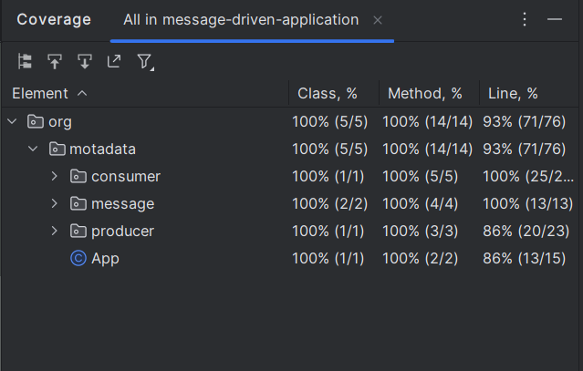
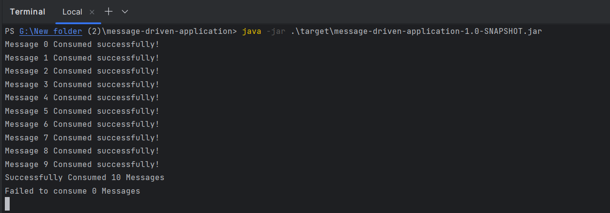

### Tech Used 
1. Java 8
2. Maven
3. Junit 4


### Running the Code
1. **Prerequisites:**
    - Java 8 or later installed.
    - Maven
2. **Steps:**
    - Open a terminal in the project directory.
    - Build the project using Maven:

      ```bash
      mvn clean package
      ```

    - This will generate a JAR file named `target/message-driven-application-1.0-SNAPSHOT.jar` (version may vary).

    - Run the compiled program:

      ```bash
      java -jar target/message-driven-application-1.0-SNAPSHOT.jar

3. **Running Tests:**

    - To run JUnit tests:

      ```bash
      mvn clean test
      ```

### Code Coverage



### Example Output

